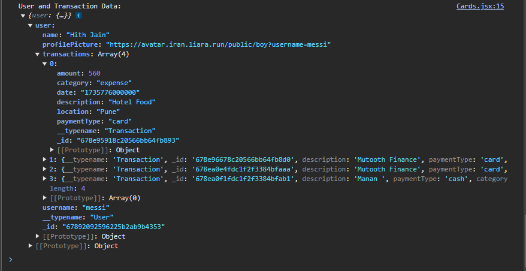
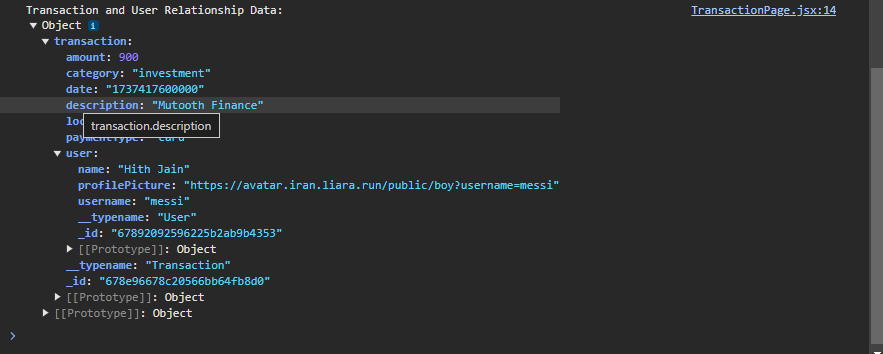

# graphql package =>
- It is the core GraphQL implementation in **JavaScript**
- It provides the functionality to define GraphQL shcemas, aprse and validate GraphQL queries, execute queries against a schema, and format responses.
- GraohQL is not tied to any specific server or client framework; it's a standalone library that can be used in various JavScript enviroments.

#  @apollo/server =>
- This package is part of the Apollo ecosystem and is used for building GraphQL servers in Node.js.
- It provides tools and utilities to create and manage GraphQL shcemas, handle incoming GraphQL requests, execute, queries and send responses.
- @apollo/server is built on top of the popular express framework, making it easy to integrate GraphQL into existing Node.js web applications.
- Overall, @apollo/server simplifies the process of creating and manitaining GraphQL servers in Node.js enviroments.

# What is GraphQL schema?
- A GraphQL schema is a fundamental concept in GraphQL
- It defines the structure of the data that clients can query and the operations they can perform. A schema in GraphQL typically consists of two main parts: typeDefs and resolvers.

# What is typeDefs? (or Type Definitions)
- Type Definitins define the shape of the data available in the GraphQL API. They specify the types of objects that can be queried and the relationships between them.

# What are Resolvers?
- Resolvers are functions that determine how to fetch the data and associated with each field in the schema.
- They are responsible for resolving the queries and mutations defined in the type definitions and returning the requested data.

# What is Serialization?
- It is the process of converting the user objects into a format that can be stored and retrieved easily.

# Authentication
- We will be using passportjs for the authentication of the users.
- First with the help of local auth strategy we will be either logging in or registering a user after that we will serialize the user object so that it can be stored as session (userId) in the database then it will be then used as (connet.sid) sid ie session id for next time logging in(verification).

- We will be using local storage for authetication and it will be Http only which makes it more secure and it cannot be accessed by javaScript inorder to get the details   


# "connect-mongodb-session": "^5.0.0",
- This will allow us to store the sessions created of the user object for authentication.

# "passport": "^0.7.0", "graphql-passport": "^0.6.8",
- This the the main authetication library/ package that will be used. Since passport alone itself just provides compatibilty with restapi and since we are using graphql api we will be using graphql-passport which will make it compatible to work passport authetication with graphql.

# What is "context"?
- Context is basically an object that is shared across all the resolvers   

# What does this do "{authUser && <Header/>}"?
- Wrapping the header component in authUser gives it the condition that that component can only be seen when user has logged in or else they might not be able to see.

# Why we use "...inputs"?
- In the transaction typeDef we have created input for createTransaction and UpdateTransaction and inside that we have defined numerours variable like id, usernmae etc so if we want to call all those variables with their id then we will use ...inputs which will call them altogether like we will not have to call them seperately . It is just a way to write neat and clean code.

# Notes on `categoryColorMap` and `Card` Component

## Overview
The code snippet demonstrates a method for associating gradient colors with different categories such as `savings`, `expense`, and `investment`. This is achieved using a JavaScript object and a functional React component. 

## Implementation Details

### `categoryColorMap` Object
- The `categoryColorMap` is a JavaScript object that maps category names to their corresponding gradient color classes.
- Example mapping:
  ```javascript
  const categoryColorMap = {
    saving: "from-green-700 to-green-400",
    expense: "from-pink-800 to-pink-600",
    investment: "from-blue-700 to-blue-400",
    // Add more categories and corresponding color classes as needed
  };
  ```
- This approach centralizes the color definitions, making the code easy to maintain and extend.

### `Card` Component
- The `Card` component receives a prop called `cardType`.
- The `cardClass` constant is assigned a value based on the `cardType` using the `categoryColorMap` object.
  ```javascript
  const Card = ({ cardType }) => {
    const cardClass = categoryColorMap[cardType];
  };
  ```
- This approach simplifies the logic for determining the CSS class for a card.

## Comparison with Traditional Approach
- **Current Approach:**
  - Uses a mapping object (`categoryColorMap`) for color associations.
  - The mapping provides a clear and extendable structure.
  ```javascript
  const categoryColorMap = {
    saving: "from-green-700 to-green-400",
    expense: "from-pink-800 to-pink-600",
    investment: "from-blue-700 to-blue-400",
  };

  const Card = ({ cardType }) => {
    const cardClass = categoryColorMap[cardType];
  };
  ```

- **Traditional Approach:**
  - Uses an `if-else` or `switch` statement to determine the color.
  - This can be more verbose and less scalable.
  ```javascript
  const Card = ({ cardType }) => {
    let cardClass;
    if (cardType === "savings") {
      cardClass = "from-green-700 to-green-400";
    } else if (cardType === "expense") {
      cardClass = "from-pink-800 to-pink-600";
    } else if (cardType === "investment") {
      cardClass = "from-blue-700 to-blue-400";
    }
  };
  ```

## Advantages of the Mapping Approach
1. **Scalability:** Adding new categories is easier as it only involves updating the `categoryColorMap` object.
2. **Readability:** The color mappings are centralized and straightforward to understand.
3. **Maintainability:** Reduces repetitive conditional logic, making the codebase cleaner.

# What is the meaning of InMemoryCache and credentials:"include" in?
```javascript
const client = new ApolloClient({
  uri : 'http://localhost:4000/graphql',
  cache : new InMemoryCache(),
  credentials : "include",
});
```
- Uri Specifies the URL of the graphl server , Cache creates a new in-memory cache insttance which stores the results of previous queries to avoid refeteching data and credentials set to true will basically tell the client to include credentials (cookies, authentication tokens) in request to the GraphQL server.The InMemoryCache stores this data in the client's "kitchen" (memory) so that next time you make the same query (order the same burger), the client can just retrieve the data from the cache instead of sending a new request to the server. The cache is really usefull for optimizing performance.

# What does the wrapping do?
```javascript
  <ApolloProvider client={client}>
    <App />
  </ApolloProvider>
```
- Imagine you have a big library with many books. You want to make sure that all the people in your house can access the books easily. So, you create a special bookshelf that holds all the books and makes them available to everyone in the house.
In a similar way, ApolloProvider is like a special bookshelf that holds a powerful tool called Apollo Client. This tool helps your React application fetch and manage data from a server.
When you use ApolloProvider, you're making the Apollo Client tool available to all the components in your React application. This means that any component can use the tool to fetch and manage data.

# What does "useParam()" do?
```javascript
import { useParams } from "react-router-dom";
```
- useParams is a hook that returns an object of the URL parameters in the current route.
It allows you to access the parameters in the URL and use them in your component.
For example, if the URL is http://example.com/users/123, the useParams hook will return an object like {id: '123'}.
You can then use the id parameter in your component to fetch the user data or perform any other action.

```javascript
<Route path ="/transaction/:id" element={data.authUser ?  <TransactionPage /> : <Navigate to="/login"/>} />
```
As we can see that in the transaction route path we have decalared id so the useParam hook will take the id from this path and then it can be used to call data which is associated to this id.


# How is this app superfast in terms of getting the data and other operations?


- So our application uses the concept of caching the memory
so in the second image we can see that when the user is in the homepage only two queries are run ie the GetAuthenticatedUser and GetTransaction($id: transactionId)
when the user goes to update transaction page and updates the transaction and then again comes to the homepage instead of calling the query once again graphql will use the cached memory to fetch the updated data hence making it superfast and light-weight. 

# How will the data be dynamically fetched and plotted in the graph on the homepage which will be different for different users?
```javascript
        categoryStatistics: async (_, __, context) => {
            if (!context.getUser()) throw new Error("Unauthorized");
            const userId = context.getUser()._id;
            const transactions = await Transaction.find({ userId });
            const categoryMap = {};
            transactions.forEach((transaction) => {
                if (!categoryMap[transaction.category]) {
                    categoryMap[transaction.category] = 0;
                }
                categoryMap[transaction.category] += transaction.amount;
            });
            return Object.entries(categoryMap).map(([category, amount]) => ({
                category,
                amount
            }));
        },
```
- Firstly we have created an asynchronors function named categoryStatistic which will conatain the core logic for displaying the graph according to the different users and their transactions.
we will use 
```javascript
context.getUser()
``` 
to check if the user is authorised/authenticated if no then we will throw error
so inside our database the transactions will be like this
```Javascript
const transaction = [
  {category:"expense",amount:50},
  {category:"expense",amount:75},
  {category:"investment",amount:100},
  {category:"saving",amount:30},
  {category:"saving",amount:20},
];
```
- as we can see that we have two values for expense one for investement and two for saving 
So what our categoryMap function will do is it will calculate the total for each cateory and return them as
```javascript
categoryMap = {expense: 125, investment: 100, saving: 50}
```
- Now these values will be further take by the graph function in HomePage.jsx 
```Javascript
const chartData = {}
```
- The value coming from categoryMap will be passed to const chartData and then the graph will be formed
### Explanation:

1. **Function Declaration**: 
   - `categoryStatistics` is an asynchronous function that will calculate statistics based on categories for a particular user.

2. **Authentication Check**:
   - The function first checks if the user is logged in by calling `context.getUser()`. If the user is not logged in, it throws an "Unauthorized" error.

3. **Fetching User Transactions**:
   - Retrieves the `userId` from the current logged-in user and uses it to fetch all transactions from the `Transaction` model that belong to this user.

4. **Category Mapping**:
   - Initializes an empty object `categoryMap` to store the sum of transaction amounts for each category.
   - Iterates over each transaction. For each transaction:
     - Checks if the category already exists in `categoryMap`. If not, initializes it with `0`.
     - Adds the transaction's amount to the corresponding category in `categoryMap`.

5. **Result Transformation**:
   - Converts `categoryMap` into an array of objects, where each object contains a `category` and its total `amount`.

### Visualization Example:

Suppose we have the following transactions for a user:

- Transaction 1: Category: "Food", Amount: 100
- Transaction 2: Category: "Transport", Amount: 50
- Transaction 3: Category: "Food", Amount: 200

The `categoryStatistics` function will produce the following output:

```json
[
  { "category": "Food", "amount": 300 },
  { "category": "Transport", "amount": 50 }
]
```

# What to do if this becomes a large scale product then how to handle the different users and their numerours transactions?
In the resolver file
```JavaScript
User:{
      transactions:async(parent)=>{

         try {
            const transactions = await Transaction.find({userId: parent._id});
            return transactions;
         } catch (err) {
            console.err("Error in user.transactions resolver: ", err);
            throw new Error(err.message || "Internal server error.");
         }
      }
   }
```
- This function is a resolver that fetches all the transactions associated with the user. The parent argument is the user object that the GraphQL query has already fetched and is passing down to this resolver as an argument.
Example: If the user queries for a specific user and its transactions, the user object will be passed down to this resolver as the parent argument. This resolver will then use the userId from the parent to fetch all the transactions associated with that user.

# Importance of Relationships

```javascript
export const GET_USER_AND_TRANSACTIONS = gql`
    query GetUsersAndTransactions($userId: ID!){
        user(userId: $userId){
            _id
            name
            username
            profilePicture
            transactions{
                _id
                description
                paymentType
                category
                amount
                location
                date
            }
        }
    }
`
```
- For large scale production/ if there are many users then these kind of relationships are used to get the data for specific user so that the data retrieval time becomes less. The relationship that we have created between user and its transaction in the user.TypeDef.js and user.resolver.js is the reason that we are able to call the user and its transaction together in the same query.
This method ensures seamless data retireval and a better way to handle user traffic.

# What is the need of creating User Relationships?

- As seen in the screenshot the realtionships between the user and its transaction helps to fetch all the data at once which can be used to do other tasks. In large scale applications these kind of relationship helps in faster data retrieval and hence making the application really fast.

- Now as we created relationship between User and its transaction the same way we have created Relationship between the transactions and its user.

This relationship can be seen in the update transactions page as if there is some query in which the user is required of the specific transaction so in that case this relationship can take place.